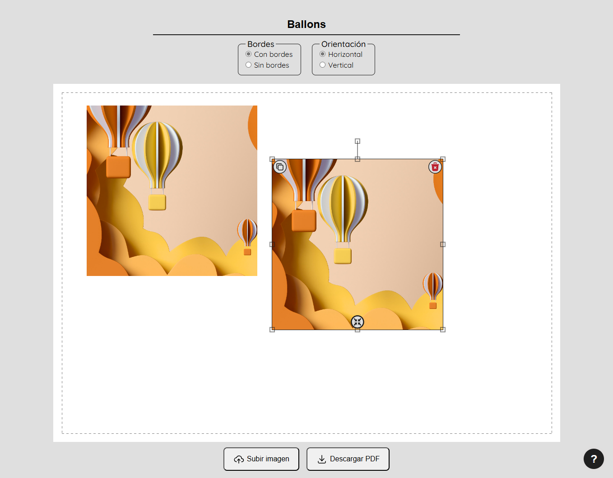

# ImageScalePrint

*Este proyecto es uno de los DEMO Open Source desarrollado originalmente para [Sublimación STAMPAD](https://stampad.mercadoshops.com.ar/). Está bajo licencia MIT.

Esta herramienta sirve para crear archivos PDF con imágenes a centímetros subidas por el usuario, para luego imprimirse en hojas A4 según sus márgenes y orientación. ✨ 

## Instalación & Dependencias

[Angular CLI](https://github.com/angular/angular-cli) version 15.2.6.

* **`npm install` para instalar todas las dependencias.**
* `ng serve` levantar el servidor de desarrollo en `http://localhost:4200/`.
  
**Librerías Externas:**
| Nombre       | Versión | Uso              | Documentación/Demo web                       |
|--------------|---------|------------------|----------------------------------------------|
| [fabric.js](https://github.com/fabricjs/fabric.js)    | v5.3.0  | Manipulación de imágenes para canvas HTML5 | http://fabricjs.com/docs/ |
| [jspdf](https://github.com/parallax/jsPDF)        | v2.5.1  | Generación de PDF A4 a partir de un canvas | https://rawgit.com/MrRio/jsPDF/master/docs/index.html |
| [ngx-toastr](https://github.com/scttcper/ngx-toastr)   | v16.2.0 | Notificaciones emergentes | https://ngx-toastr.vercel.app/ |
